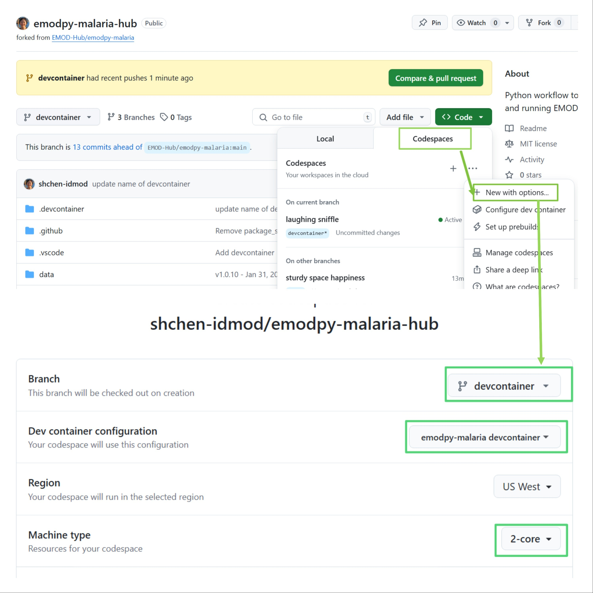
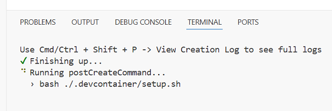
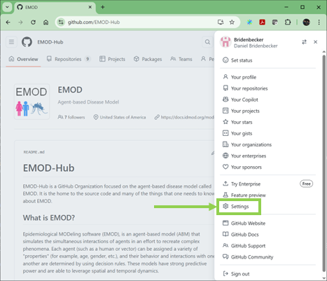
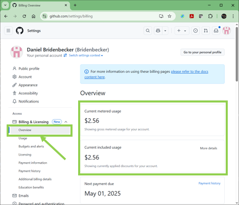
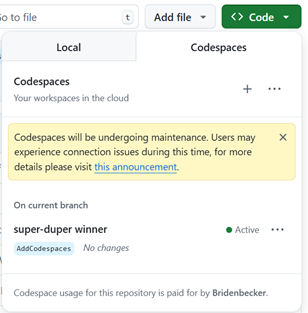
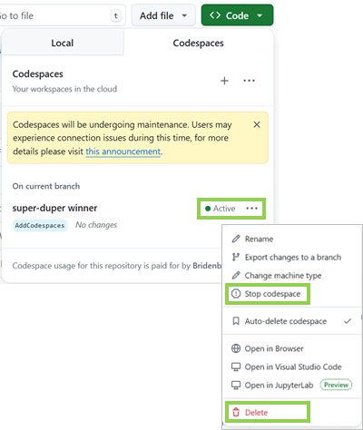

# 🧪 emodpy-hiv Dev Container

This dev container sets up a ready-to-use environment for working on the `emodpy-hiv` project for HIV using
[VS Code Dev Containers](https://code.visualstudio.com/docs/devcontainers/containers) or
[GitHub Codespaces](https://docs.github.com/en/codespaces/overview).

---

## 🐳 What's Inside

This dev container is built on top of the **universal base image**:

- `mcr.microsoft.com/devcontainers/universal:2`

It includes:

### ✨ Features Enabled

| Tool / Language  | Version       | Notes                            |
|------------------|---------------|----------------------------------|
| Python           | 3.9           | Required for EMOD                |
| Docker-in-Docker | -             | Enables Docker inside container  |
|                  |               | and ContainerPlatform            |

---

## 💻 VS Code Extensions Installed

| Extension                  | Purpose                       |
|----------------------------|-------------------------------|
| `ms-python.python`         | Python language support       |
| `ms-python.debugpy`        | Python debugging              |
| `esbenp.prettier-vscode`   | Code formatting               |
| `redhat.vscode-yaml`       | YAML syntax and validation    |

---

## 🛠️ Post-Creation Script

After the container is built, the `setup.sh` script is executed. This script performs the following tasks:
 - Install emodpy-hiv and its dependencies in development mode.  (hmm.  Do we want to it in development mode?)
 - Install the latest version of idmtools to override any older versions included with emodpy-hiv.

---

## 🚀 Getting Started to build dev container in local VS Code

1. Install [Docker](https://www.docker.com/products/docker-desktop)
2. Install [Visual Studio Code](https://code.visualstudio.com/)
3. Install the [Dev Containers extension](https://marketplace.visualstudio.com/items?itemName=ms-vscode-remote.remote-containers)
4. Open the project folder in VS Code
5. Press `F1` and run: `Dev Containers: Rebuild Container`
6. Wait for the container to build and start
7. Open a terminal in VS Code
8. Run your Python scripts as needed

## 🛠️ Getting Started to build dev container in GitHub Codespaces

1. Open the project in GitHub Codespaces tab
2. Select "+" to create a new codespace on the selected branch
3. Or select an existing codespace to open in browser
4. Wait for the container to build and start
    - Wait for postCreateCommand setup.sh to run.  If you execute pip freeze in the terminal window and don't see a bunch of packages, you need to wait.
5. Open a terminal in Codespaces
6. Run your Python scripts

### Waiting for the postCreateCommand - setup.sh

### 🧪 Example Run 

### 🧪 Example debugging

---

## $$$ Cost of Using Codespaces $$$
Codespaces is a GitHub feature that allows you to run code in a virtual machine owned by GitHub.  It can **COST MONEY** so please be aware.
GitHub gives each user 120 core hours per month for free.  Please see the
[GitHub documentation on Codespaces](https://docs.github.com/en/billing/managing-billing-for-your-products/managing-billing-for-github-codespaces/about-billing-for-github-codespaces)
for more information.

### Checking Codespaces Usage
To check your usage & billing status, do the following:

1. Select your user options icon in the upper right corner when you are logged into GitHub.

2. Select the `Settings` option from the drop down menu.

3. On the new web page, select `Billing & Licensing`

4. From the drop down menu, select the `Overview` option.

5. From this page, you should be able to see information on what you have spent and any discounts you get
6. If you need to use Codespaces more than the 120 core hours, consider checking with your organization on any Enterprise options with GitHub.

### Stopping & Deleting a Codespace
Closing the browser tab does **NOT** stop your Codespace.  You can go back to it because it is still `active`.
This can be a nice feature when you need to step away, let things run in the background, or reboot your computer.
However, since it is active, you are still using your Codespace and **can still incur charges.**

To avoid needless changes, consider `stopping` and/or `deleting` your Codespace when you are done or won't get back to it
for a long period of time.

To stop or delete the code space, got back to the `Code` button where you created your Codespace.

If you see that you have an active Codespace, select the `...` ellipse button and the select `Stop Codespace` and/or `Delete`.

