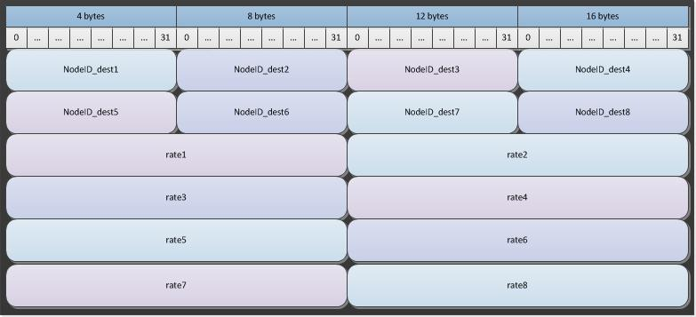

# Migration files

Migration files describe the rate of migration of individuals *out* of a geographic *node*.
There are additional configuration parameters you can set to define the migration patterns and
return time. There are four types of migration files that can be used by EMOD, namely, local
migration, regional migration, air migration and sea migration files. The demographics file can be
configured to exclude some nodes from certain types of travel.

Local migration describes foot travel into adjacent nodes. Regional migration describes migration
that occurs on a road or rail network. Air migration describes migration that occurs by plane; you
must indicate that a node has an airport for air migration from that node to occur. Sea migration
describes migration that occurs by ship travel; you must indicate that a node has a seaport for sea
migration from that node to occur. For both air and sea migration, it's possible to originate in a
node with an airport or seaport and migrate to a node without one, but the reverse is not true.
Unlike the other migration files, the sea migration file only contains information for the nodes
that are seaports.

To use the migration files, in the configuration file you must set **Migration_Model** to a valid
migration type and indicate the path to the migration files you want to use. You must also set a
parameter to enable each type of migration you want to include in the simulation. There are
additional parameters in the configuration file you can use to scale or otherwise modify the data
included in the migration files. The migration rate can be differentially set by age and/or gender.
Additionally, a modifier can be applied for the migration rates to follow a distribution curve in
the population. For more information, see [parameter-configuration-migration](parameter-configuration-migration.md) parameters.

Migration data is contained in a set of two files, a metadata file with header information and a
binary data file. Both files are required. To create these files see, [software-migration-creation](software-migration-creation.md). 

## JSON metadata file

The metadata file is a JSON-formatted file that includes a metadata section and a node offsets
section. The **Metadata** section contains a JSON object with parameters, some of which are
strictly  informational and some of which are used by EMOD. However, the informational ones may
still be important to understand the provenance and meaning of the data.

### Parameters

The following parameters can be included in the migration metadata file:

### Example

*See example: [migration-metadata.json](../json/migration-metadata.json)*

## Binary file

The binary file contains the migration rate data. Migration rate determines the average time until an
individual takes a trip out of the node. This time is drawn from an exponential distribution with
the parameter `\lambda` as the number of trips per day. Therefore, a migration rate of 0.1 can
be viewed as 10 days until migration, on average. You can adjust this base rate using the 
[parameter-configuration-scalars](parameter-configuration-scalars.md) parameters.

The data in the binary file is laid out in a sequential stream of 4-byte integers that identify the origin and destination nodes followed by a stream of 8-byte floats that contain the migration rate for those node pairs laid out in the same order. Therefore, the length of the stream is defined by **DatavalueCount**. For each source node, there must be **DatavalueCount** `\times` (4 bytes + 8 bytes). 

The following image shows how a binary file with a **DatavalueCount** value of 8 would be laid out. 

