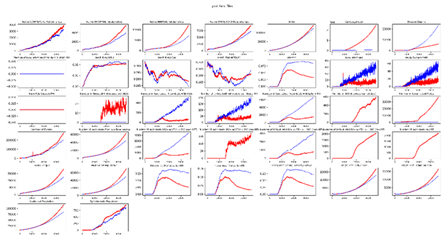
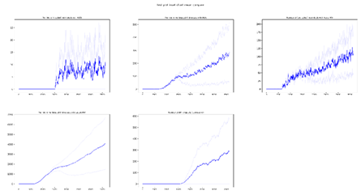
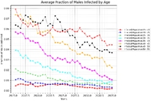
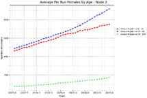
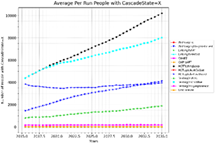
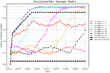
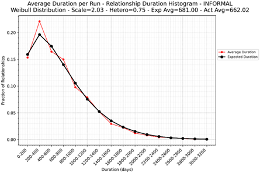
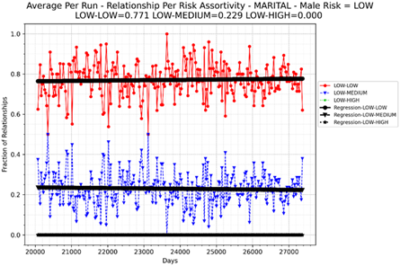

# Plot simulation output

emodpy-hiv includes several scripts for plotting simulation output directly from the command line.
Each script accepts a file or directory of output files and produces one or more plots, either
displayed interactively or saved to an output directory. Run any script with `--help` to see the
full list of options.

## plot_inset_chart

Plots all channels from one or more [InsetChart.json](software-report-inset-chart.md) files as a
grid of subplots. Up to three comparison files can be overlaid against a reference.

```
python -m emodpy_hiv.plotting.plot_inset_chart -d output/
```



## plot_inset_chart_mean_compare

Compares the mean of [InsetChart.json](software-report-inset-chart.md) files of up to three
directories. Each directory can contain multiple InsetChart.json files from individual runs, like
an experiment directory; the script calculates and plots the mean for each directory, allowing you
to compare results between different scenarios or parameter sets.

```
python -m emodpy_hiv.plotting.plot_inset_chart_mean_compare baseline/ intervention/
```



## plot_hiv_by_age_and_gender

Plots data from [ReportHIVByAgeAndGender.csv](software-report-age-gender.md). Use the `-p` option
to select what to plot — options include `population`, `prevalence`, `risk`, `vmmc`, `art`,
`state`, `column`, and `summary`.

```
python -m emodpy_hiv.plotting.plot_hiv_by_age_and_gender output/ -p art -a
```






## plot_relationship_end

Plots relationship duration histograms from [RelationshipEnd.csv](software-report-relationship-end.md),
with an option to overlay the expected Weibull distribution.

```
python -m emodpy_hiv.plotting.plot_relationship_end output/ -t marital -x
```



## plot_relationship_start

Plots relationship assortivity by risk group from
[RelationshipStart.csv](software-report-relationship-start.md).

```
python -m emodpy_hiv.plotting.plot_relationship_start output/ -t marital -r LOW
```



## Additional plotting utilities

Additional Python utilities are available for more advanced use, including converting channel
reports to DataFrames, generic x/y plotting, and file discovery across experiment directories.
See the [API reference](../autoapi/emodpy_hiv/plotting/index.md) for full details.
