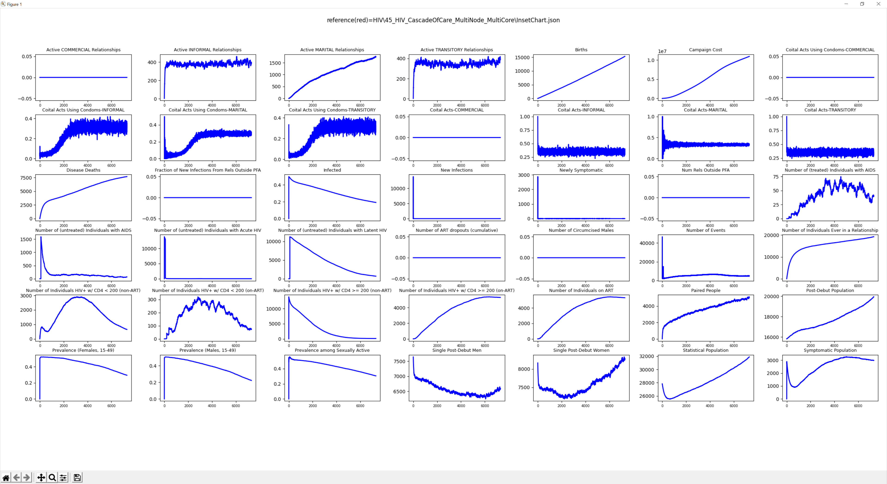

# InsetChart

The inset chart (InsetChart.json) is an output report that is automatically generated with every simulation.
It contains simulation-wide averages, one per time step, for a wide number of data *channel*\ s.
The channels are fully specified by the simulation type and cannot be altered without making changes
to the EMOD source code. Python or other tools can be used to create charts out of the information
contained in the file (see the example charts provided at the end of this page.)

## Configuration

To generate the report, the following parameters must be configured in the config.json file:

```json
{
    "Enable_Default_Reporting": 1,
    "Report_HIV_Event_Channels_List": ["NewInfectionEvent", "HIVNeedsHIVTest", "HIVPositiveHIVTest"],
    "Inset_Chart_Coital_Acts": 1,
    "Inset_Chart_Has_Interventions": ["PrEP"],
    "Inset_Chart_Has_IP": ["InterventionStatus"],
    "Inset_Chart_Include_Pregnancies": 1
}
```

## Output file data

### Headers

When running HIV simulations, the header section will contain the following parameters.

### Channels

When running HIV simulations, the following channels are included in the InsetChart.json file.
For channels related to the HIV stage (latent, acute, AIDS), these definitions are described in more
detail in [hiv-model-intrahost](hiv-model-intrahost.md).

## Example

The following is an example of an HIV-specific InsetChart.json.

*See example: [report-HIV-inset-chart.json](../json/report-HIV-inset-chart.json)*


