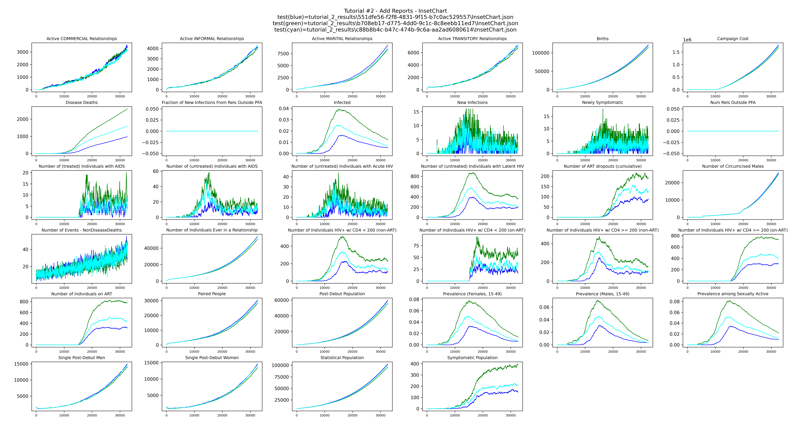
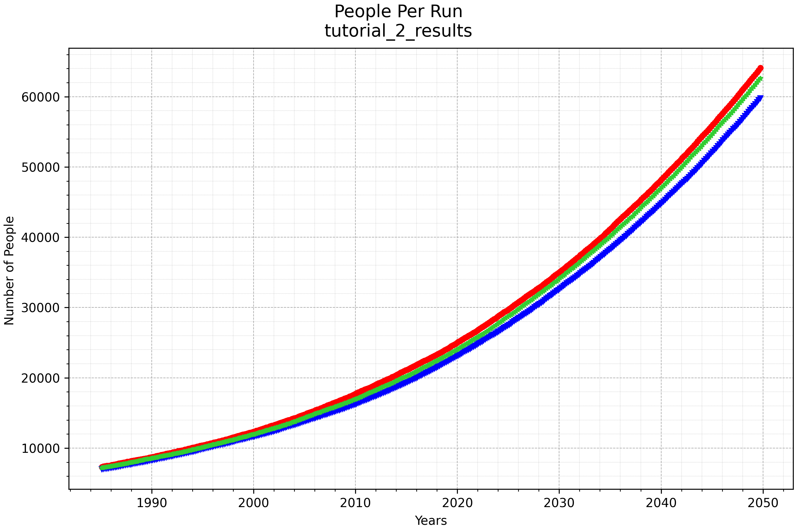
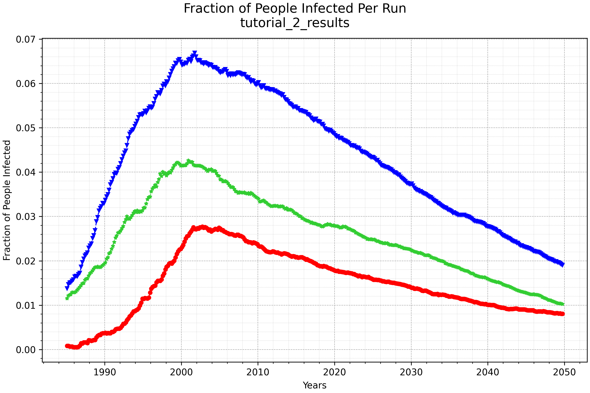
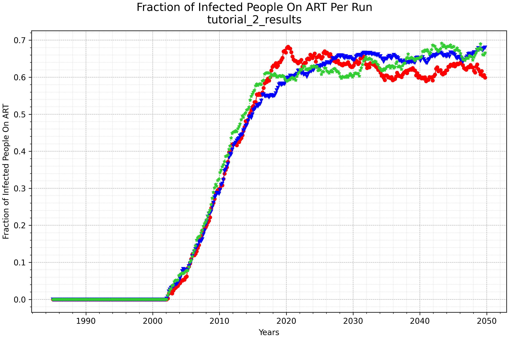

# Tutorial 2: Add reports and plot results

This tutorial builds on Tutorial 1 by adding output reports, downloading the results, and
plotting the data. It introduces the `report_builder` argument, idmtools analyzers, and the
emodpy-hiv plotting utilities.

**File:** `tutorials/tutorial_2_reports.py`

## Adding reports

A `build_reports()` function configures the reporters to add to the simulation. This tutorial
adds three reports:

```python
from emodpy_hiv.reporters.reporters import ReportSimulationStats, ReportHIVByAgeAndGender
from emodpy_hiv.reporters.reporters import ReportFilter, InsetChart

reporters.add(InsetChart(...))
reporters.add(ReportSimulationStats(reporters_object=reporters))
reporters.add(ReportHIVByAgeAndGender(
    reporters_object=reporters,
    report_filter=ReportFilter(start_year=1985, end_year=2070),
    reporting_period=365 / 6,
    collect_gender_data=True,
    collect_age_bins_data=[15, 20, 25, 30, 35, 40, 45, 50],
    ...))
```

- **InsetChart** — per-time-step summary of simulation-wide disease metrics
- **ReportSimulationStats** — performance and memory usage per time step
- **ReportHIVByAgeAndGender** — HIV outcomes stratified by age, gender, and other dimensions

The function is passed to `EMODTask.from_defaults()` as the `report_builder` argument:

```python
task = emod_task.EMODTask.from_defaults(
    ...
    report_builder=build_reports)
```

## Downloading results

After the experiment completes successfully, idmtools provides an `AnalyzeManager` and
`DownloadAnalyzer` to retrieve the output files. This approach works the same regardless of
platform — if you are using the Container platform, the files are copied from the container
directory; if you are using COMPS or SLURM, they are downloaded from the cluster.

```python
from idmtools.analysis.analyze_manager import AnalyzeManager
from idmtools.analysis.download_analyzer import DownloadAnalyzer

filenames = ['output/InsetChart.json', 'output/ReportHIVByAgeAndGender.csv']
analyzers = [DownloadAnalyzer(filenames=filenames, output_path=output_path)]

manager = AnalyzeManager(platform=platform, analyzers=analyzers)
manager.add_item(experiment)
manager.analyze()
```

The download only runs when `experiment.succeeded` is true, so a failed experiment does not
produce a confusing partial set of results.

After the download completes, `tutorial_2_results/` contains one subdirectory per simulation,
named by its unique ID, each holding the two reports we specified for download:

```
tutorial_2_results/
  551dfe56-f2f8-4831-9f15-b7c0ac529557/
    InsetChart.json
    ReportHIVByAgeAndGender.csv
  b708eb17-d775-4dd0-9c1c-8c8eebb11ed7/
    InsetChart.json
    ReportHIVByAgeAndGender.csv
  c88b8b4c-b47c-474b-9c6a-aa2ad6080614/
    InsetChart.json
    ReportHIVByAgeAndGender.csv
```

The plotting utilities read across all subdirectories and save the resulting images to the
top-level `tutorial_2_results/` directory.

## Plotting results

After downloading, the emodpy-hiv plotting utilities create charts from the output files:

```python
import emodpy_hiv.plotting.plot_inset_chart as ic
import emodpy_hiv.plotting.plot_hiv_by_age_and_gender as ang

ic.plot_inset_chart(dir_name=output_path, output=output_path)
ang.plot_population_by_age(dir_or_filename=output_path, img_dir=output_path)
ang.plot_prevalence_for_dir(dir_or_filename=output_path, img_dir=output_path)
ang.plot_onART_by_age(dir_or_filename=output_path, img_dir=output_path)
```

The resulting images are saved to `tutorial_2_results/`. See
[Plot simulation output](../emod/software-plotting.md) for more details on the available
plotting utilities.

`plot_inset_chart` produces a grid of all channels from the `InsetChart.json` of each run,
with one line per realization, giving a quick overview of the simulation over time:



`plot_population_by_age` shows the population over time for each run:



`plot_prevalence_for_dir` shows the fraction of the population infected with HIV over time
for each run:



`plot_onART_by_age` shows the fraction of infected people on ART over time for each run:


