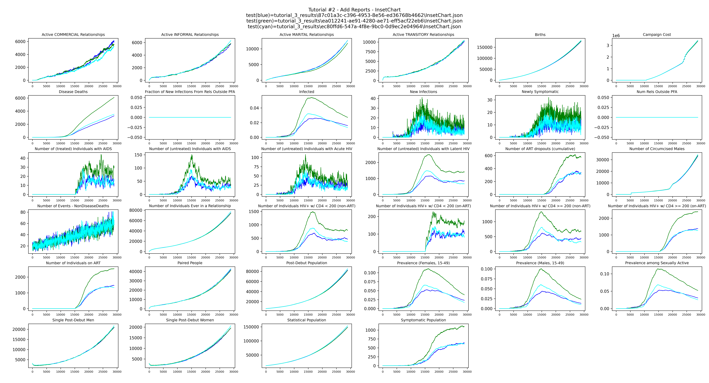
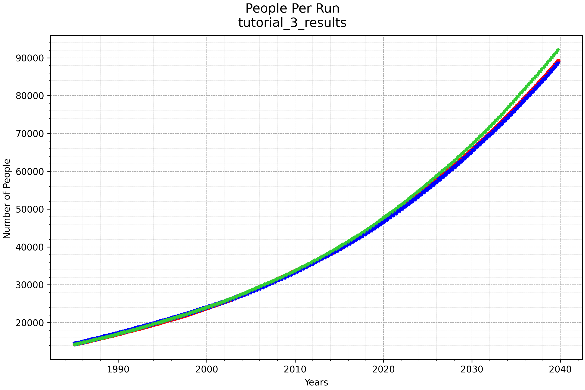
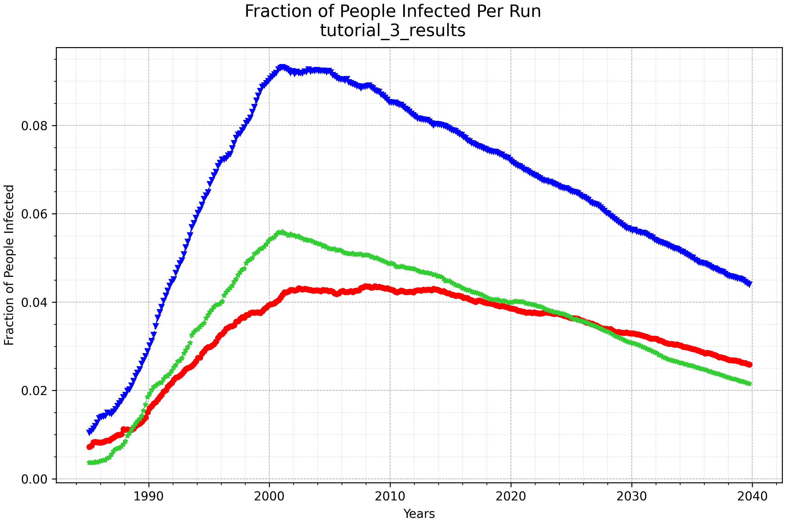
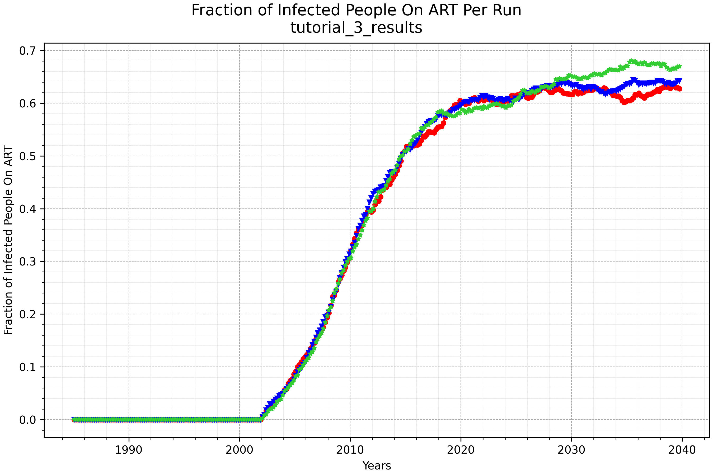

# Tutorial 3: Customize with build functions

This tutorial introduces custom build functions — the mechanism for modifying the baseline
country model. Instead of passing the Zambia model's functions directly to `EMODTask`, you
write your own that call the baseline first and then apply additional changes.

**File:** `tutorials/tutorial_3_build_functions.py`

## What are build functions?

Build functions are the functions that `EMODTask` calls to construct the configuration files
for each simulation. There are four:

| Function | Purpose |
|----------|---------|
| `build_config(config)` | Sets simulation-wide configuration parameters |
| `build_campaign(campaign)` | Defines when and how interventions are distributed |
| `build_demographics()` | Sets up population, mortality, fertility, and relationship parameters |
| `build_reports(reporters)` | Configures which output reports to generate |

Each build function is called once per simulation. If your experiment has a sweep of 10
simulations, each build function runs 10 times.

## Modifying configuration

This `build_config` calls the Zambia baseline first and then modifies two parameters —
doubling the initial population and reducing the simulation duration by 10 years:

```python
def build_config(config):
    zambia = cm.ZambiaForTraining
    config = zambia.build_config(config)

    config.parameters.x_Base_Population = config.parameters.x_Base_Population * 2.0
    config.parameters.Simulation_Duration = config.parameters.Simulation_Duration - (10 * 365)

    return config
```

The larger population makes the simulation more statistically robust, while the shorter
duration partially offsets the added runtime. Simulations may take 5–7 minutes.

## Adding an intervention to the campaign

This `build_campaign` calls the Zambia baseline to build the standard care cascade and then
adds an annual mass distribution of a long-acting PrEP (LA-PrEP) intervention starting in 2025,
with coverage increasing each year. Using a Python `for` loop avoids duplicating the same
event configuration 15 times in JSON:

```python
def build_campaign(campaign):
    zambia = cm.ZambiaForTraining
    zambia.build_campaign(campaign)

    laprep = ControlledVaccine(campaign,
                               waning_config=MapPiecewise(
                                   days=[0, 180, 210, 240, 270, 300, 330],
                                   effects=[0.8, 0.8, 0.7, 0.5, 0.3, 0.1, 0.0]),
                               common_intervention_parameters=CIP(intervention_name="LA-PrEP"))

    ip_restrictions = PropertyRestrictions(
        individual_property_restrictions=[["Accessibility: Yes", "Risk: HIGH"],
                                          ["Accessibility: Yes", "Risk: MEDIUM"]])

    laprep_coverages = [0.1, 0.3, 0.5, 0.5, 0.5, 0.7, 0.7, 0.7, 0.8, 0.8, 0.8, 0.8, 0.9, 0.9, 0.9]
    start_year = 2025
    for coverage in laprep_coverages:
        start_day = (start_year - 1960.5) * 365
        add_intervention_scheduled(campaign, start_day=start_day,
                                   target_demographics_config=TDC(demographic_coverage=coverage),
                                   property_restrictions=ip_restrictions,
                                   intervention_list=[laprep])
        start_year += 1

    return campaign
```

The `ip_restrictions` target only people who have access to healthcare (`Accessibility: Yes`)
and are at high or medium risk. This property must exist in the demographics — which is what
`build_demographics` sets up.

## Modifying demographics

This `build_demographics` calls the Zambia baseline and then raises the proportion of the
population with access to healthcare to 90%:

```python
def build_demographics():
    zambia = cm.ZambiaForTraining
    demographics = zambia.build_demographics()

    demographics.AddIndividualPropertyAndHINT(
        Property="Accessibility",
        Values=["Yes", "No"],
        InitialDistribution=[0.9, 0.1],
        overwrite_existing=True)
    return demographics
```

## Using custom build functions

The custom functions are passed to `EMODTask.from_defaults()` in place of the country
model's built-in ones:

```python
task = emod_task.EMODTask.from_defaults(
    eradication_path=manifest.eradication_path,
    schema_path=manifest.schema_file,
    config_builder=build_config,
    campaign_builder=build_campaign,
    demographics_builder=build_demographics,
    report_builder=add_reports)
```

The rest of the script — sweeping `Run_Number`, running the experiment, downloading results,
and plotting — is the same as Tutorial 2. Results are saved to `tutorial_3_results/`.

`plot_inset_chart` produces a grid of all channels from the `InsetChart.json` of each run,
with one line per realization, giving a quick overview of the simulation over time:



`plot_population_by_age` shows the population over time for each run:



`plot_prevalence_for_dir` shows the fraction of the population infected with HIV over time
for each run:



`plot_onART_by_age` shows the fraction of infected people on ART over time for each run:


