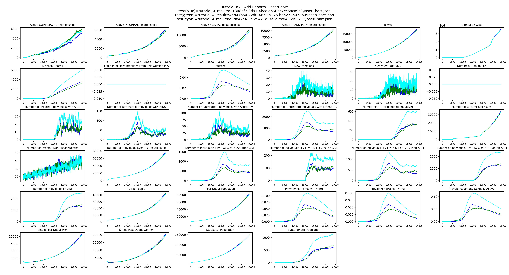
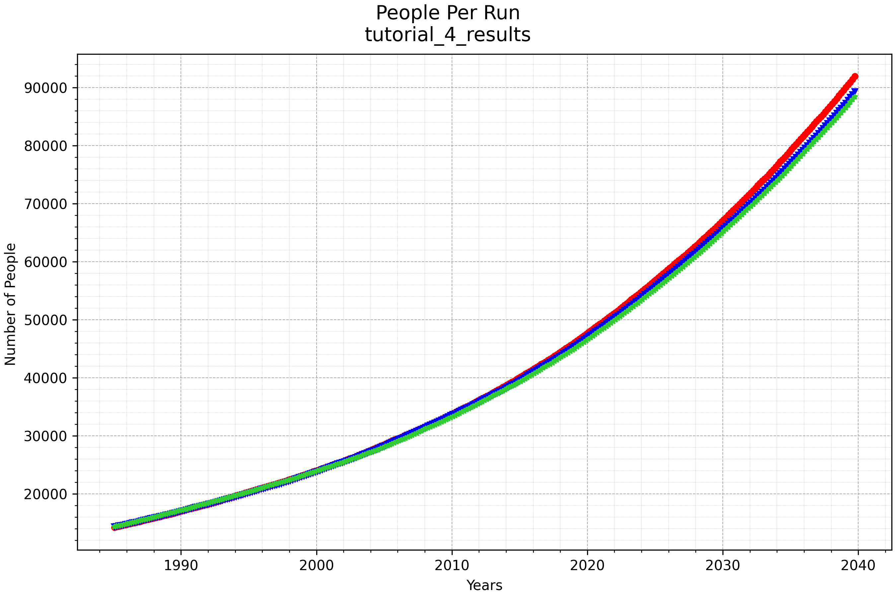
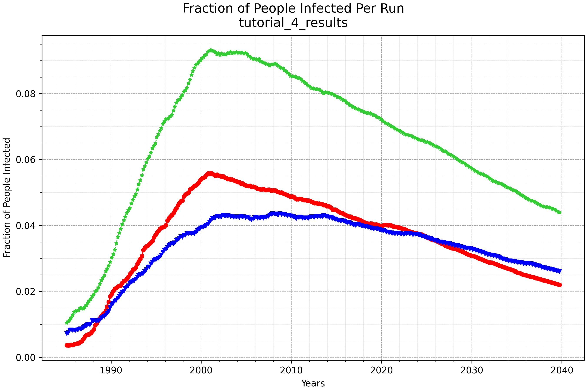
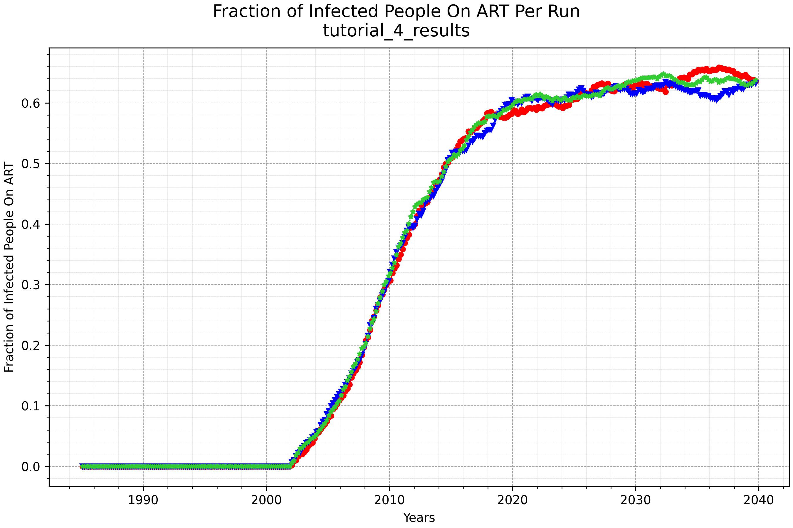

# Tutorial 4: Override the cascade of care

This tutorial shows how to customize the HIV cascade of care by subclassing a country model
and overriding one of its cascade state methods.

**File:** `tutorials/tutorial_4_overriding_coc.py`

## The country model and cascade of care

Each country model has a `build_campaign()` method that constructs the cascade of care — the
series of states representing testing, diagnosis, linkage to care, ART staging, and treatment.
The cascade is built by calling a set of `add_state_*` class methods, each of which adds one
state. To customize the cascade, subclass the country model and override one or more of those
methods.

## Subclassing the country model

`MyZambia` subclasses `ZambiaForTraining` and overrides `add_state_HCTUptakeAtDebut`:

```python
class MyZambia(ZambiaForTraining):
    country_name = 'MyZambia'

    @classmethod
    def add_state_HCTUptakeAtDebut(cls, campaign, start_year, node_ids=None):
        ...
```

All other cascade states are inherited unchanged from `ZambiaForTraining`.

## What the baseline state does

The baseline `HCTUptakeAtDebut` state listens for the `STIDebut` event, which is broadcast
when a person first seeks sexual relationships. When triggered, it uses a sigmoid distribution
to determine the probability that the person enters the testing loop or waits and reconsiders
later.

## What the override does

The override runs the baseline sigmoid logic only for the first 35 years (1990–2025). Starting
in 2025, when a person debuts sexually they first receive a long-acting PrEP intervention
before going through the same sigmoid decision:

```python
# Run baseline sigmoid logic for 35 years (expires in 2025)
duration = 35 * 365
add_intervention_triggered(campaign,
                           intervention_list=[uptake_choice],
                           triggers_list=[coc.CustomEvent.STI_DEBUT],
                           start_year=start_year,
                           duration=duration)

# Starting in 2025: distribute LA-PrEP at debut, then broadcast an event
# that triggers the same sigmoid decision
laprep = ControlledVaccine(campaign, waning_config=MapPiecewise(...), ...)
broadcast_sigmoid = BroadcastEvent(campaign, sigmoid_event)

add_intervention_triggered(campaign,
                           intervention_list=[laprep, broadcast_sigmoid],
                           triggers_list=[coc.CustomEvent.STI_DEBUT],
                           start_year=laprep_start_year)

# Apply the same sigmoid decision when the broadcast event is heard
add_intervention_triggered(campaign,
                           intervention_list=[uptake_choice],
                           triggers_list=[sigmoid_event],
                           start_year=laprep_start_year)
```

Notice that `uptake_choice` is defined once and reused in both the pre-2025 and post-2025
listeners. In JSON this configuration would need to be duplicated — using Python avoids that
and keeps the logic consistent.

## Using the subclassed model

The build functions replace `ZambiaForTraining` with `MyZambia`:

```python
def build_config(config):
    zambia = MyZambia
    config = zambia.build_config(config)
    ...

def build_campaign(campaign):
    zambia = MyZambia
    zambia.build_campaign(campaign)
    ...
```

When `MyZambia.build_campaign()` is called, Python's method resolution automatically picks
up the overridden `add_state_HCTUptakeAtDebut` — no other changes to the build functions
are required.

The rest of the script — sweeping `Run_Number`, running the experiment, downloading results,
and plotting — is the same as Tutorial 3. Results are saved to `tutorial_4_results/`.

`plot_inset_chart` produces a grid of all channels from the `InsetChart.json` of each run,
with one line per realization, giving a quick overview of the simulation over time:



`plot_population_by_age` shows the population over time for each run:



`plot_prevalence_for_dir` shows the fraction of the population infected with HIV over time
for each run:



`plot_onART_by_age` shows the fraction of infected people on ART over time for each run:


